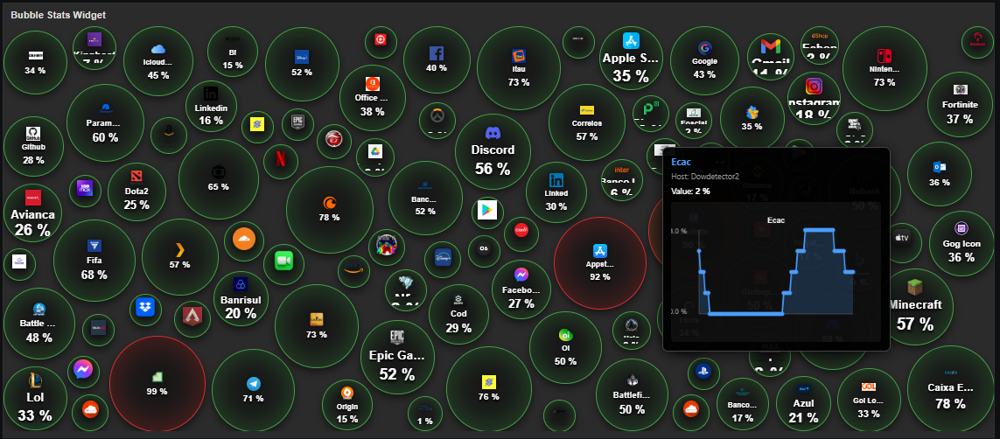
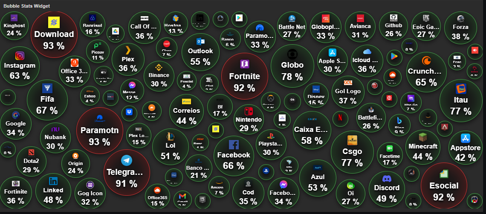

# Zabbix Bubble Stats Widget

[](https://github.com/mauro/zabbix-bubble-stats)
[](https://github.com/mauro/zabbix-bubble-stats/releases)
[](LICENSE)

Widget de visualização em formato de bolhas para o Zabbix, inspirado no Crypto Bubbles.

---

## 📖 Documentação Completa

A documentação deste projeto foi organizada e migrada para uma estrutura **MkDocs**.

Para acessar a documentação detalhada:

1.  **[Início e Visão Geral](docs/index.md)**
2.  **[Guia de Instalação](docs/installation.md)**
3.  **[Guia Rápido (Quickstart)](docs/quickstart.md)**
4.  **[Exemplos Práticos](docs/examples.md)**
5.  **[Guia de Imagens e Ícones](docs/images.md)**
6.  **[Simulação Downdetector](docs/simulation.md)**
7.  **[Análise Técnica](docs/technical_analysis.md)**

---

## 🚀 Resumo do Projeto

O **Bubble Stats Widget** transforma métricas e problemas do Zabbix em bolhas flutuantes interativas.

### Principais Recursos
*   **Visualização**: Bolhas com tamanho e cor dinâmicos baseados em métricas ou severidade.
*   **Física Interativa**: Movimento natural e colisão entre bolhas.
*   **Flexibilidade**: Suporta métricas (items) e problemas (triggers).
*   **Personalização**: Ícones personalizados, cores e comportamentos ajustáveis.

*   **Personalização**: Ícones personalizados, cores e comportamentos ajustáveis.

---

## 📸 Screenshots





---

## 💡 Inspiração e Motivação

Este módulo foi criado para preencher uma lacuna visual importante no ecossistema Zabbix.

**O Problema**: A maioria dos dashboards do Zabbix são **grids estáticos** de números ou gráficos de linha. É difícil responder rapidamente perguntas como: *"Qual o servidor que está consumindo **proporcionalmente** mais recursos agora?"* ou *"Qual o tamanho relativo deste problema em comparação com os outros?"*.

**A Inspiração**: Inspirado no site **[Crypto Bubbles](https://cryptobubbles.net/)**, que permite visualizar o mercado de criptomoedas de forma instantânea:
*   Tamanho da bolha = Volume/Importância
*   Cor da bolha = Tendência (Alta/Baixa)
*   Movimento = Mercado vivo

**A Solução**: O **Bubble Stats Widget** traz essa mesma lógica para a infraestrutura de TI. Ele torna o monitoramento **vivo e orgânico**, permitindo identificar outliers e tendências num piscar de olhos, algo que tabelas e gráficos tradicionais falham em comunicar com a mesma velocidade.


## 🛠️ Como Gerar o Site de Documentação

Este projeto inclui um arquivo `mkdocs.yml` para facilitar a geração de um site estático de documentação.

1.  Instale o MkDocs e o tema Material:
    ```bash
    pip install mkdocs-material
    ```

2.  Visualize localmente:
    ```bash
    mkdocs serve
    ```

3.  Gere o site estático (pasta `site/`):
    ```bash
    mkdocs build
    ```
